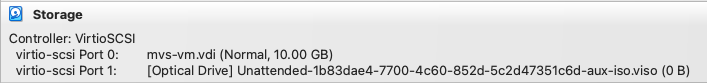

- Attempted to re-create a [[Turnkey MVS]] VM
	- re-attempt of  [[Sep 1st, 2025]]
	- Summary
		- Delete `mvs-vm` directory
		  logseq.order-list-type:: number
		- In VirtualBox
		  logseq.order-list-type:: number
			- GUI
			  logseq.order-list-type:: number
				- [New]
				  logseq.order-list-type:: number
				- New Virtual Machine Dialog
				  logseq.order-list-type:: number
					- `VM Name` = `mvs-vm`
					  logseq.order-list-type:: number
					- `VM Folder` = `/Users/johnnycyberseed/workspace/learn/ibmz/hercules`
					  logseq.order-list-type:: number
					- `ISO Image`= `/Users/johnnycyberseed/workspace/learn/ibmz/hercules/ubuntu-22.04.5-live-server-arm64.iso`
					  logseq.order-list-type:: number
					- Set up unattended guest OS installation
					- `User Name` = `jtigger`
					  logseq.order-list-type:: number
					- `Password` = https://start.1password.com/open/i?a=TEWYWIRW3VBYTA5RYVDTHG6HNQ&v=yiegtgotulknzdjdrfykzgse7u&i=t323yibfiwii5tbsbvaxnkw5bu&h=rubiner-ryan.1password.com
					  logseq.order-list-type:: number
					- [x] Install Guest Additions
					- Specify Virtual Hardware
						- `Base Memory` = `2048 MB`
						- `Number of CPUs` = `2`
						- [x] Use EFI
					- Specify a Virtual hard disk
						- (o) Create a New Virtual Hard Disk
							- `Disk Size` = `10.00 GB`
							- Hard disk type and format = `VDI`
							- [x] Pre-allocate Full Size
					- [FINISH]
				-
			- CLI
			  logseq.order-list-type:: number
				- TBD (using `VirtualBox` CLI)
				  logseq.order-list-type:: number
		- I noticed that the device boot order is wrong: hard-drive before optical (ISO)
		  logseq.order-list-type:: number
			- 
			  logseq.order-list-type:: number
		- logseq.order-list-type:: number
			- logseq.order-list-type:: number