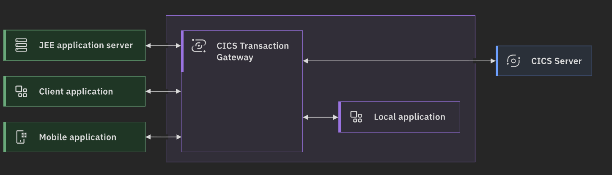
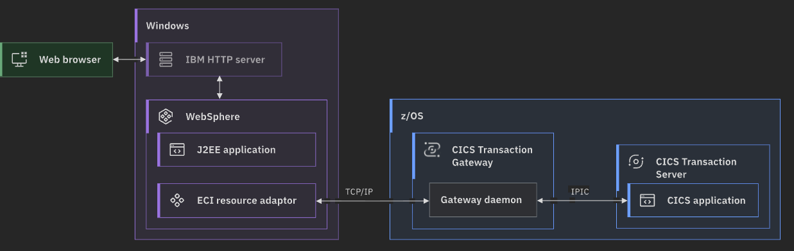

- CICS Transaction Gateway
- Connectivity Middleware
	- allows non-mainframe applications to invoke CICS applications
-
- # Architecture
	- ## Deployment Options
		- Diagram: Generic Deployment
		  collapsed:: true
			- 
		- ### Remote Mode
			- Diagram
			  collapsed:: true
				- 
			- Possible to connect to [[CICS/TS]] vis [[CICS/EXCI]] for higher-performance over "pipes"
			-
		- ref: [IBM Docs > CICS TG > Deployment Topologies](https://www.ibm.com/docs/en/cics-tg-zos/10.1.0?topic=overview-deployment-topologies)
	- ## Editions of TG
		- TG Desktop Edition — single-user
		- TG for Multiplatform —100s to 1000s users
		- TG for z/OS — 1000+ users
		- ref: [IBM Docs > CICS TG > Overview](https://www.ibm.com/docs/en/cics-tg-zos/10.1.0?topic=overview)
- # Essential Operation
	- The Gateway translates a ECI call into a [[CICS/DPL]] to ultimately invoke a [[CICS/Application Program]]
	- what's actually happening under the covers on the CICS side is a DPL call —
	- the gateway drives a LINK to a program in the CICS TS region
	  over whichever protocol (EXCI or IPIC) is configured.
	-
	- [[CICS/TG/ECI]] call 
	      |
	  [[CICS/TG]]
	      |
	    [[CICS/IPIC]] transport (or [[CICS/EXCI]])
	      |
	    [[CICS/DPL]] mirror (CSMI) in [[CICS/TS]] 
	      |
	   Target [[CICS/Application Program]]
	- So DPL is the intercommunication programming model, and IPIC/EXCI are the wire protocols that carry it.
- # References
	- https://www.ibm.com/docs/en/cics-tg-zos/10.1.0