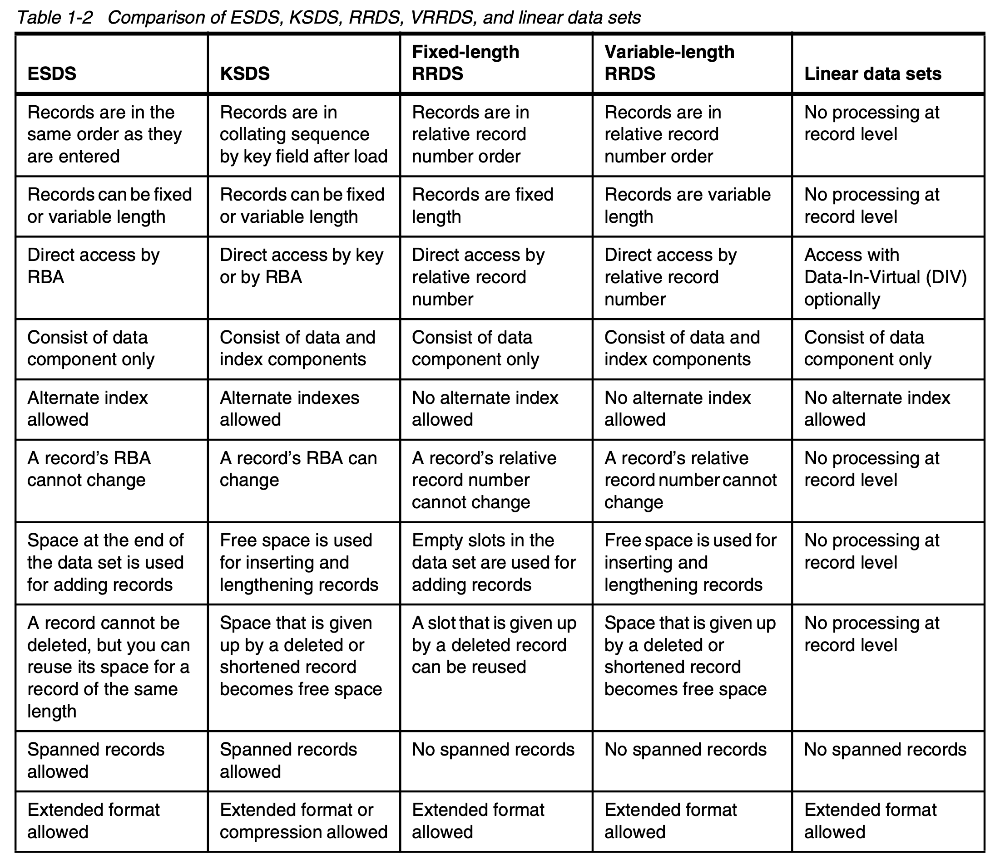

- Virtual Storage Access Method
- provided by the [[VSAM]] facility
- A family of data set types optimized for performance and flexible access
- Types:
	- [[Data Set/Type/VSAM/Entry-Sequenced (ESDS)]]
	- [[Data Set/Type/VSAM/Key-Sequenced (KSDS)]]
	- [[Data Set/Type/VSAM/Relative Record (RRDS)]]
	- [[Data Set/Type/VSAM/Variable-length Relative Record (VRRDS)]]
	- [[Data Set/Type/VSAM/Linear (LDS)]]
-
- Comparison (diagram)
	- {:height 0, :width 800}
-