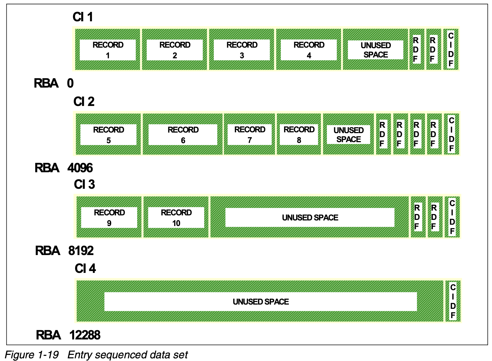

- a sequential set of records (the VSAM equivalent of [[Data Set/Type/Physical Sequential (PS)]])
- created using the [[utility/IDCAMS]]'s ((6877e0f3-3ad1-4aa7-a2d7-068c7d4e2e7b)) with the ((6877f357-9738-47fd-a3ff-5fb2c09c1f90)) parameter
- all new records are _always_ placed at the end of the data set
- records are never deleted
	- it is up to the application to mark records as such
- records can be updated, but their length cannot be changed
	- to effectively change a record's length IBM advises
		- add a new version of the record at the end of the data set
		- re-use another record of the desired length as invalid
- records are never split
- access types
	- sequential
		- you can supply an ((687664aa-f465-4c56-860c-eaf22bf31e25)) to start from a specific record
	- direct
		- you supply the ((687664aa-f465-4c56-860c-eaf22bf31e25))
	- skip sequential (not supported)
- components (diagram)
	- {:height 0, :width 800}
-
-