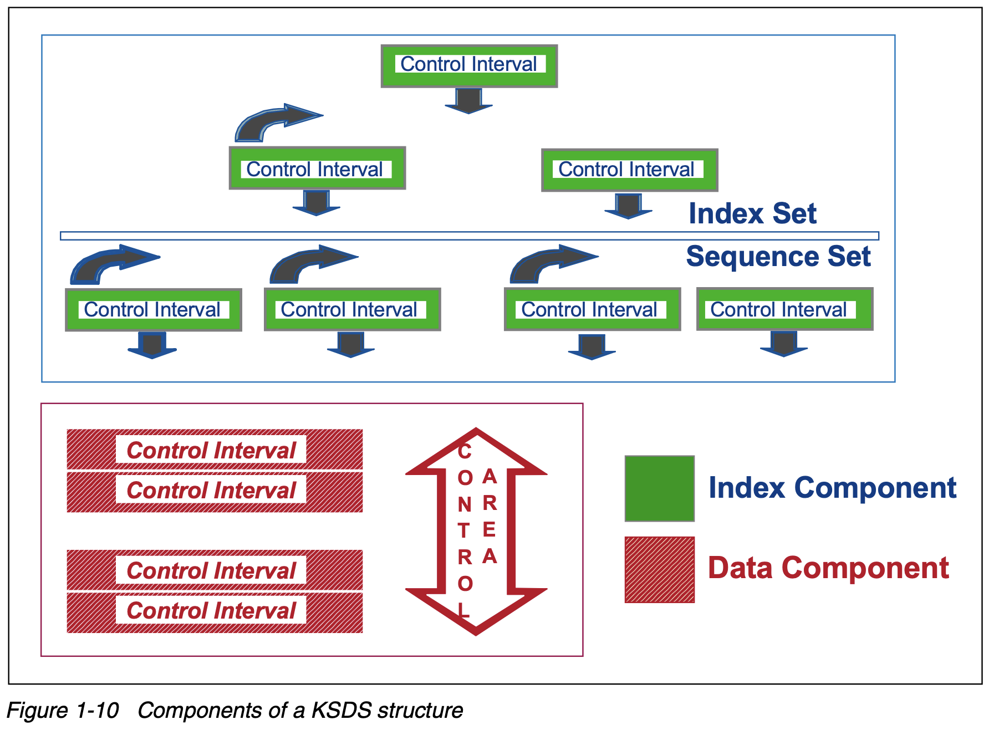

- records accessed by key (the hashmap of VSAM)
- records can either be fixed-length or variable-length
- the key field has the following restrictions
	- can be from 1 to 255 bytes
	- across all [[VSAM/Logical Record]]s,
		- the key length must be the same
		- the key value must be unique
	- the key value is immutable
- also
	- when a [[VSAM/Logical Record]] is
- Components (diagram)
	- {:width 800}
- created using the [[utility/IDCAMS]]'s ((6877e0f3-3ad1-4aa7-a2d7-068c7d4e2e7b)) with the ((6877e0f6-a278-4009-8565-f3711df822d1)) parameter