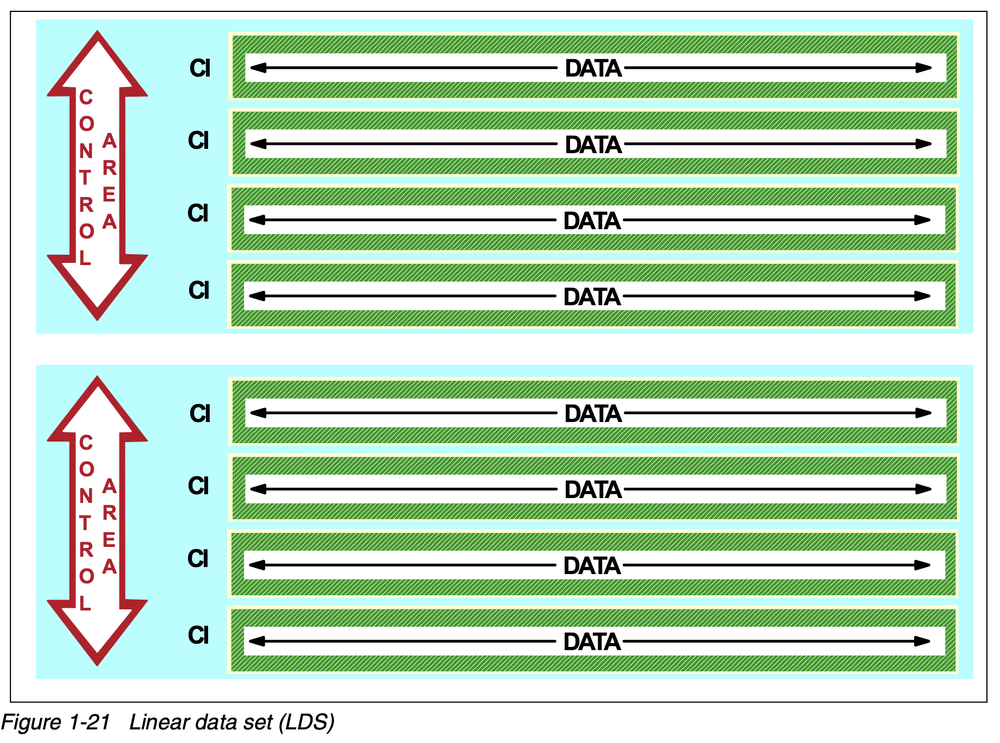

-
- created using the [[utility/IDCAMS]]'s ((6877e0f3-3ad1-4aa7-a2d7-068c7d4e2e7b)) with the ((6877fa2b-c92c-4270-81dd-5633cb0587db)) parameter
- [[VSAM/Control Interval]] sizes are multiples of 4KB
- all bytes are data bytes
	- there is no embedded control information
- [[VSAM/Logical Record]]s in an LDS must be blocked and deblocked by the client program.
- think: LDS is a non-VSAM data set with with some VSAM facilities
- most commonly used by:
	- [[DB2]]
	- [[VSAM/Data-in-Virtual (DIV)]]
- Components (diagram)
	- {:height 0, :width 800}
-
-