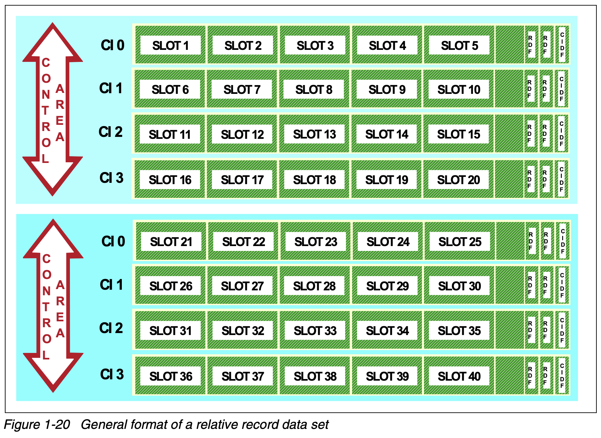

- Records accessed by ((6877ea5c-4c5a-4654-8c55-ff8655832285))
	- think: the array type in VSAM
- records are stored in "slot"s
	- fixed length
	- pre-formatted
- created using the [[utility/IDCAMS]]'s ((6877e0f3-3ad1-4aa7-a2d7-068c7d4e2e7b)) with the ((6877f5d2-5ccd-4169-bbb2-23c2fa3ba138)) parameter
- access types
	- sequentially
		- in stored record order
		- empty slots are skipped
	- direct
		- provide the ((687664aa-f465-4c56-860c-eaf22bf31e25))
		- VSAM can calculate the ((6877f86b-4661-4ec6-a0a4-ed55341fdaf8)) by formula
	- skip-sequentially
		-
	-
- Components (diagram)
	- {:height 0, :width 800}