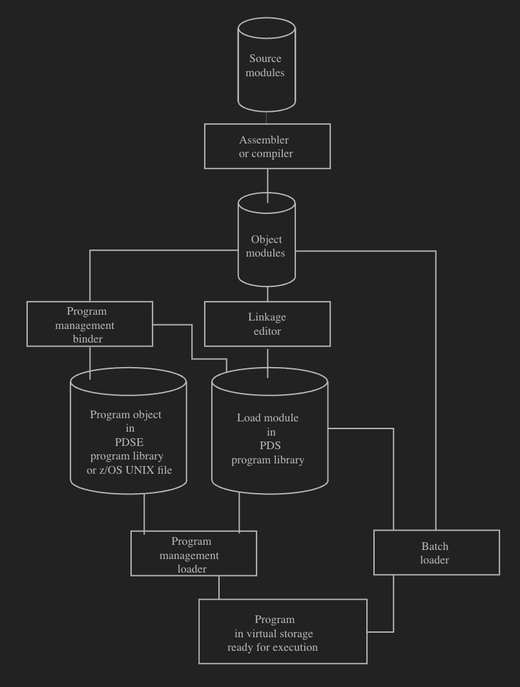

- Process
	- Source is coded (e.g. in COBOL)
	  logseq.order-list-type:: number
		- typically in an [[FB80]] in a PDS (e.g. `&SYSUID.SRCELIB`)
		  logseq.order-list-type:: number
	- Source is compiled to an  [[object module]]
	  logseq.order-list-type:: number
		- typically in an [[FB80]] in a PDS (referred to as an [[object library]] )
		  logseq.order-list-type:: number
	- An [[object module]] is linked into
	  logseq.order-list-type:: number
		- logseq.order-list-type:: number
	- logseq.order-list-type:: number
- Diagram
	- {:height 818, :width 614}
	-