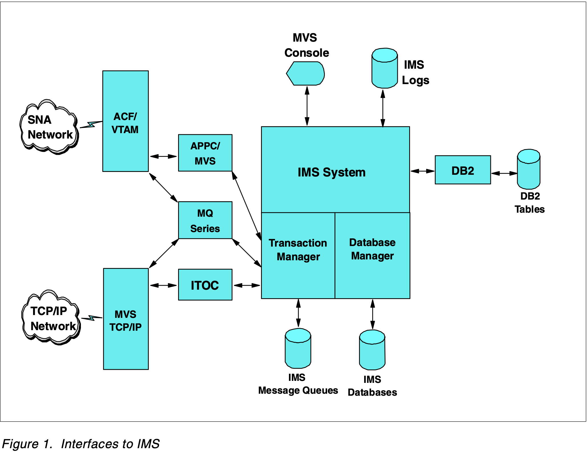

- Information Management System
- has been known as: "IMS/ESA"
- Parts of IMS
	- [[IMS DB]]
	- [[IMS TM]]
	- [[IMS/DC]]
	- Interfaces to IMS (diagram)
	  collapsed:: true
		- {:height 200, :width 800}
- IMS Access Methods
	- VSAM (the same as [[Data Set/Type/VSAM]]?)
	- OSAM
-
- #  History
	- 1968 — first introduced
	- Was inspired from bespoke spaceship parts management as part of the Apollo program
	  collapsed:: true
		- src: https://mediacenter.ibm.com/media/Intro+to+IMS+-+What+is+IMS/0_beoagp8k/139456202
	-
- # References
	- https://www.ibm.com/products/ims
	- https://www.ibm.com/docs/en/ims/latest
	- [IMS Primer (Redbook)](https://www.redbooks.ibm.com/abstracts/sg245352.html)
	- [IBM IMS Central](https://imsdev.github.io/index.html)
		- "training" videos
		- self-paced courses
		- sample code repos
	- IMS Insiders: https://imsinsiders.wordpress.com/about/
	-
	-
	-
- # Personal Learning
- Concepts to explore
	- RECON record information
- Questions and Confusions
	-
-
-