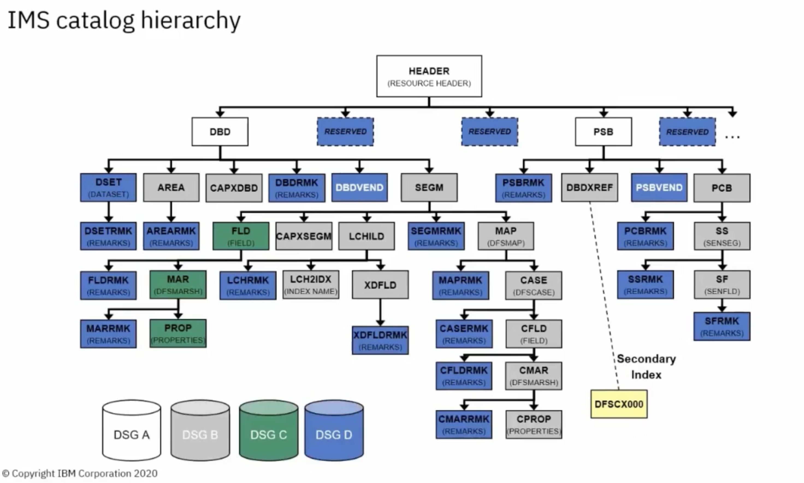

-
- HEADER — indicates which kind of resource
	- [[IMS/DBD]]
	- [[IMS/PSB]]
		- each have one or more [[IMS/PCB]]s
	-
- Segments within the IMS Catalog Hierarchy (diagram)
	- {:height 0, :width 1200}
	- Segment names typically correspond to macro statements in the DBD and [[IMS/PSB]] source.
	- There are four (4) Data Set Groups (DSNs are not necessarily mapped to the color codes; just illustrating):
		- White — `<HALDB data set prefix>.A00001`
		- Grey — `<HALDB data set prefix>.B00001`
		- Green — `<HALDB data set prefix>.C00001`
		- Blue — `<HALDB data set prefix>.D00001`
	- and two additional:
		- HIDAM index — `<HALDB data set prefix>.X00001`
		- ILDS data set — `<HALDB data set prefix>.L00001`
- There are two first child level segments for site customization: `DBDVEND` and `PSBVEND`
- IMS Catalog DBDs
	- The DBD reserved name for the PHIDAM database is `DFSCD000`
	- The DBD reserved name for the PSINDEX database is `DFSCX000`
- IMS Catalog PSBs
	- `DFSCPL00` — used for the initial load process
	- `DFSCP001` — used for updated access
		- e.g. ACBGEN and Catalog Populate utility (i.e. `DFS3UACB`), and purge utility
	- `DFSCP000` — used for read access from COBOL/ [[HLASM]] programs
	- `DFSCP002` — used for read access from PL/1 programs
	- `DFSCP003` — used for read access from PASCAL programs
	-
	-