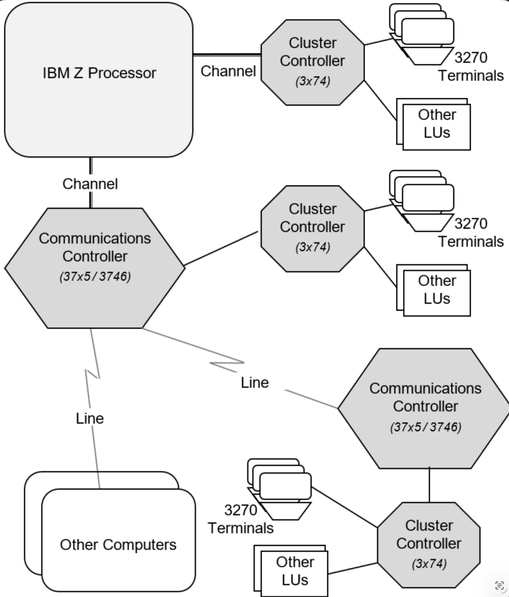

- Systems Network Architecture
- IBM’s proprietary networking architecture
- full stack of
	- protocols
	- roles
	- controls
- for
	- interactive terminals,
	- printers, and
	- application-to-application messaging
- across IBM systems.
- comparable in scope to “TCP/IP,” but older and designed around IBM hosts and controllers.
- Typical SNA Network Elements (diagram)
  collapsed:: true
	- {:width 800}
		- src: [[What On Earth is A Mainframe? (book)]]
- Comparing [[TCP\IP]] and [[SNA]] (table)
  collapsed:: true
	- | TCP/IP | SNA |
	  | --- | --- |
	  | Specify the computer you want to talk to via **IP Address**. | No need to specify the computer |
	  | Specify the application program you want to talk to via a **port number** | Specify the program you want to talk to via the Logical Unit ([[SNA/LU]]) |
	  | Routing is done by the network | You manually define the route from your computer to the other computer |
	  | You can talk to any other computer on the network | SNA subarea networks are point-to-point. Only APN networks can be routed. |
	  | No need for extra hardare — computers can talk directly if they have a connection | You need [[SNA/PU]]s between two [[SNA/LU]]s |
	  | Includes tools like file transfer (FTP) and 3270 terminal emulation | No tools. |
	  | Is an "open" networking protocol | Is a "proprietary" networking protocol, owned by IBM |
	  | Easy to connect computers of other platforms (UNIX and Windows) | Difficult to connect other computer systems to the Mainframe |
	  | Must do a lot of work to make the network secure | Because it's so defined, it's more secure |
	  | Almost universally used. | Only used to communicate with IBM Mainframe and midrange computers |
	  | Can be used to connect to the Internet | No options for connecting to the Internet |
	-
	-
	-
	-