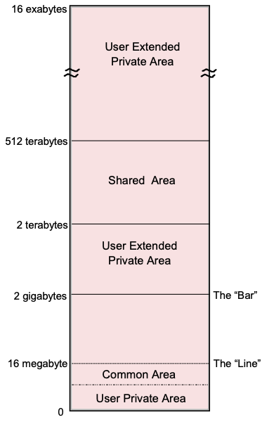

- the runtime container where programs and their data are accessed
	- errors are isolated to the address space
- within an address space, users can start multiple tasks using [[z/OS/Control Block/TCB]]s
- analogous to a UNIX process
	- [[address space/ASID]]
- [[address space/private area]]
- Storage Map:
	- 
	-
-
	-