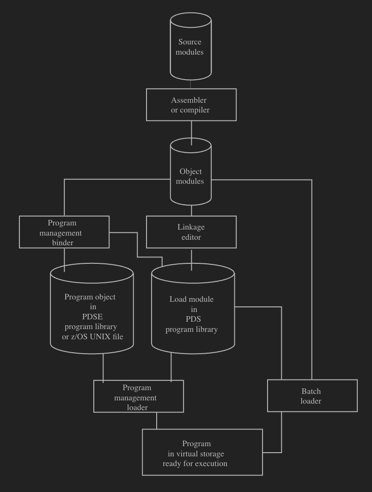

- the generic term for an executable on z/OS.
- there are two systems:
	- Legacy
		- (Source Listing) => Compiler => (object module) => Linkage Editor => (load module) => Batch Loader => (executable in memory)
	- Program Management (new)
		- (Source Listing) => Compiler => (object module) => Binder => (program object / load module) => Loader => (executable in memory)
	- load modules
		- legacy
		- limited to 16M in size
		- lives in a [[Data Set/Type/Partitioned Data Set (PDS)]]
	- program objects
		- newer
		- stored in a [[Data Set/Type/Extended PDS (PDSE)]]
-
- # How Program Modules are Made
	-
	- diagram
		- {:height 0, :width 800}
		-
-
- # References
	- Introduction to Program Mangement — https://www.ibm.com/docs/en/zos/2.5.0?topic=zmpmugr-introduction
		-
	-